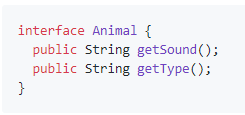
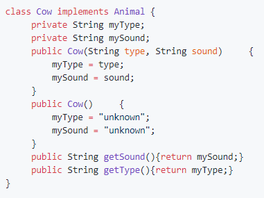
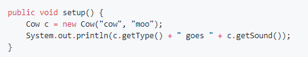
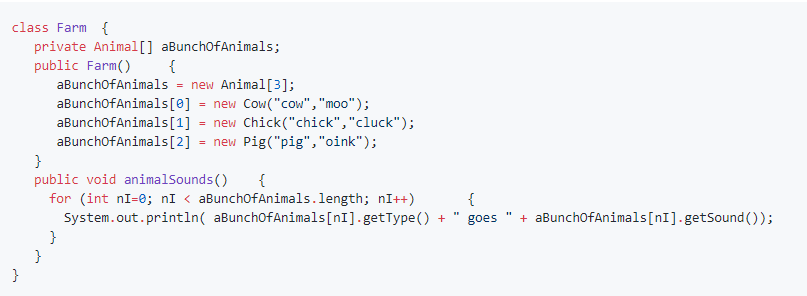
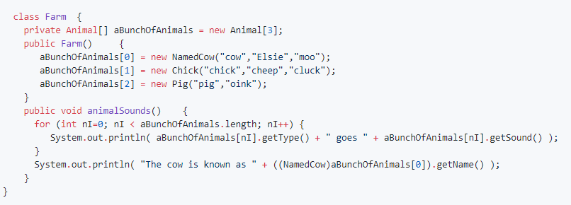

OldMacDonald
================

Start by forking and the cloning [this repository](https://github.com/APCSLowell/OldMacDonald). As you read through the assignment below, add code to your OldMacDonald program when you get to any instructions in *italics*.  You may find slides 53 - 130 on [OOP--Interfaces, Inheritance & Encapsulation](https://docs.google.com/presentation/d/1Eldw10Y6tP7Ru6pjaCcZPhm5vxjnKjVrWLB8qT5IiF0/edit?usp=sharing) and the [encapsulation](https://drive.google.com/open?id=0Bz2ZkT6qWPYTZDQ3NjFmMTctNTRlOS00NjAxLTg3YjQtZTMzMGVjYjA0YjA5) worksheets helpful. 

Background: Inheritance and Polymorphism
---------------------------------------- 
In this assignment we will use Old MacDonald's Farm to learn how `implements` and `extends` work, and the meaning of *inheritance* and *polymorphism*.

Defining an interface
---------------------
Old MacDonald had a farm that had several types of animals. Every animal shared certain characteristics: they had a type (such as cow, chick or pig) and each made a sound (moo, cluck or oink). This interface defines those things required to be an animal on the farm.   
          
*Complete the Animal interface in the `Animal.java` file. Run the program to make sure it compiles and runs.*

Once we know what it takes to be an Animal, we can define new classes for the cow, chick and pig that implement the Animal interface. Here is a Cow class meeting the minimum requirements to be an Animal.   
    
     
*Add the Cow class to the `Cow.java` file.
Implement classes for the chick and the pig. Run the program to make sure it compiles and runs.
Add the following code to your `setup()` function in the `OldMacDonald.pde` file, and run the program to verify your work so far. Make sure you create some chick and pig instances in `setup()`and check their sounds as well.*   
        
*Now add the following Farm class to the `Farm.java` and test all your animals.*
      
*Now, change your code in `setup()` to create an new instance of type `Farm` and call its `animalSounds` function.*  

It turns out that the chick is a little confused. Sometimes it makes one sound, when she is feeling childish, and another when she is feeling more grown up. Her two sounds are "cheep" and "cluck".
*Modify the Chick class code to allow a second constructor allowing two possible sounds and the `getSound()` function to return either sound, with equal probability, if there are two sounds available.
You will also have to modify your Farm class code to construct the Chick with two possible sounds.*

Finally, it also came to pass that the cows get a personal name, like Elsie.

*Create a new class, `NamedCow` in the `NamedCow.java`, that extends the Cow class. `NamedCow` will need a member variable to store the name, a 3 argument constructor with arguments for the Cow's name, type and sound and a new accessor function: `getName`. For full credit `NamedCow` needs to be encapsulated, all members should be labeled `public` or `private`, do NOT redefine or copy any functions or variables that `NamedCow` inherits from `Cow`. You may want to change the member variables in `Cow` to `protected` instead of `private`*
    
The final Farm code to exercise all your modifications is shown here:   
       

What Did You Just Do?
---------------------
So you don't miss it, make sure you understand what you just accomplished. Having an array of `Animal` objects and then having the `getSound()` function dynamically decide what sound to make is *polymorphism*. This is also known as late binding because it wasn't known until run-time that `aBunchOfAnimlas[1]`, for example, really had a `Chick` object. You started with an `interface` for an `Animal` and then used the keyword `implements` in making the three types of animals. Then you created a specialized version of the `Cow`, a `NamedCow`, using the keyword `extends`. This illustrates the concept of inheritance. The `NamedCow` had all the attributes and functions of the Cow and then added some: a new field and a new function to access the cow's name.
Note that there is no web page for this assignment, so you will submit the url of your GitHub repository for the assignment. The url will have the form
`http://github.com/ <your github username > /OldMacDonald`

*Note: this assignment was adapted from Roger Frank's APCS assignments*
